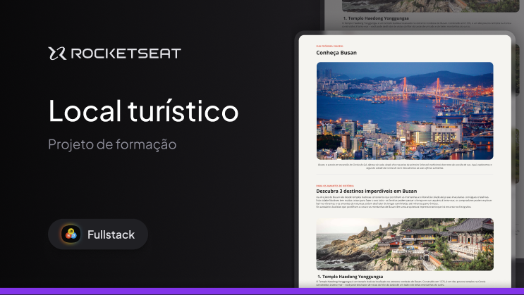

# tourist-guide

----------------------------------------------------------------------------------------------------

<!-- MODELO PROJETO FINALIZADO -->
<h1 align="center"> 
	 🌏 Tourist-Guide 🌏 
</h1>

<!-- ---------------------------------------------------------------------- -->

<!-- MODELO MENU DE NAVEGAÇÃO -->

 <a href="#-Descrição-do-entregável">Descrição do Entregável</a> •
 <a href="#-sobre-o-projeto">Sobre</a> •
 <a href="#-funcionalidades">Funcionalidades</a> •
 <a href="#-layout">Layout</a> • 
 <a href="#-como-executar-o-projeto">Como executar</a> • 
 <a href="#-tecnologias">Tecnologias</a> • 
 <a href="#-autor">Autor</a> • 
 <a href="#user-content--licença">Licença</a>

<!-- ---------------------------------------------------------------------- -->

<!-- MODELO DE DESCRIÇÃO -->
## 📄 Descrição do entregável

<!-- EXEMPLO DE DESCRIÇÃO DE UM PROJETO: -->
- src
  - assets
    - style
    - fonts
  -js
  -pages
  -styles
    
- index.html

---

<!-- ---------------------------------------------------------------------- -->

<!-- MODELO DESCRIÇÃO SOBRE O PROJETO: -->
## 💻 Sobre o projeto

<!-- EXPLICA O MOTIVO DO PROJETO -->
Projeto desafio da plataforma de estudos Rocketseat, onde estou fazendo uma trilha de estudos em desenvolvedor Full-Stack.  Challenge project from the Rocketseat learning platform, where I am following a Full-Stack Developer study track.
-----
Turist Guide é um site que desenvolvi a partir de um template no Figma da plataforma Rocketseat, para testar meus conhecimentos em HTML e CSS.

---

<!-- ---------------------------------------------------------------------- -->

<!-- EXEMPLO DE LAYOUT: -->
## 🎨 Layout

<!-- AQUI VOCÊ PASSA O CAMINHO DA IMAGEM -->

---

<!-- ---------------------------------------------------------------------- -->

<!-- MODELO DE COMO EXECUTAR O PROJETO -->
## 🚀 Como executar o projeto

1 - Baixar o Projeto  
2 - Abrir em um editor de código 
3 - Abrir o arquivo index.html

<!-- ---------------------------------------------------------------------- -->

<!-- MODELO DE PRÉ REQUISITOS -->
### Pré-requisitos

Antes de começar, você vai precisar ter instalado em sua máquina o seguinte editor de código:
[VSCode](https://code.visualstudio.com/)

---

<!-- ---------------------------------------------------------------------- -->

<!-- MODELO DE TECNOLOGIAS -->
## 🛠 Tecnologias

As seguintes ferramentas foram usadas na construção do projeto:

#### **Desenvolvimento**  (HTML) 

#### **Prototipação** ([Figma](https://www.figma.com/))

- **[Protótipo](https://www.figma.com/design/rTPBxfGXX8qmqfy2CNqSFB/Local-Tur%C3%ADstico--Community-?m=auto&t=Zeovc02qQbLPZXAU-6)**

---

<!-- ---------------------------------------------------------------------- -->

<!-- MODELO DE COMO CONTRIBUIR PARA O PROJETO -->
## 💪 Como contribuir para o projeto

1. Faça um **fork** do projeto.
2. Crie uma nova branch com as suas alterações: `git checkout -b my-feature`
3. Salve as alterações e crie uma mensagem de commit contando o que você fez: `git commit -m "feature: My new feature"`
4. Envie as suas alterações: `git push origin my-feature`
> Caso tenha alguma dúvida confira este [guia de como contribuir no GitHub](./CONTRIBUTING.md)

---

<!-- ---------------------------------------------------------------------- -->

<!-- MODELO DE AUTOR-->
## 🦸 Autor

<a href="https://br.linkedin.com/in/matheus-maia-alvarez-">
João Pedro de Queiroz Leite</a>
  
 

---

<!-- ---------------------------------------------------------------------- -->

<!-- MODELO DE LICENÇA -->
## 📝 Licença

Este projeto esta sobe a licença [MIT](./LICENSE).

Feito por João Pedro de Queiroz Leite [Entre em contato!](https://www.linkedin.com/in/joão-pedro-de-queiroz-leite-24020b336/)

